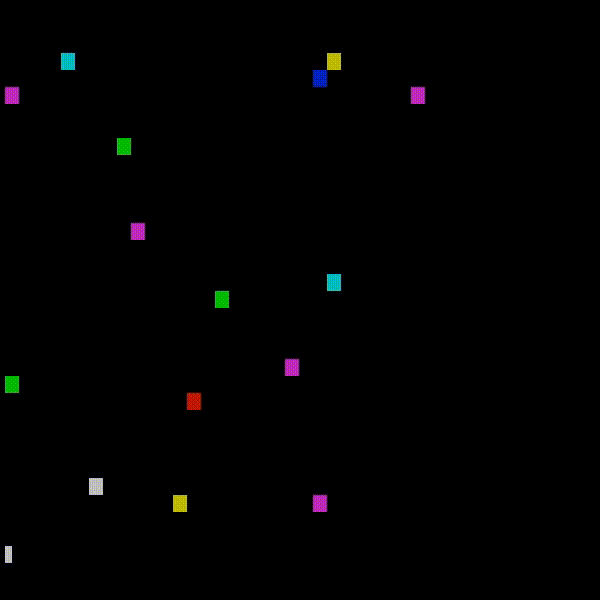

# MOTION

The use of this project is dictated be its __LICENSE__ file.

This project is a cool scene in which a collecion of coloured dots move about in a *seemingly* random manner.
There is actually *some manipulation* done to make groups of dots act the **same way**.

## How the dots move

Each dot moves around according to its set of numbers and a series of random numbers.
Each dot has *5 numbers unique to itself*, stored in a list.
When a *random number from 0 to 4* is generated, each dot moves according to its number in that place.

| NUMBER | ACTION     |
| :----: | :----:     |
| 1      | Move up    |
| 2      | Move down  |
| 3      | Move right |
| 4      | Move left  |
| 5      | Shuffle    |

The number *selected in this manner* causes dots to move in a **partly joint** manner, with different groups moving differently.
Note that this *"shuffling"* which happens to an average of **one in 5 dots** per step corresponds to a shift in the group each step.
This makes the effect more *intriguing*, and is done as follows:

```cpp
int swp = dots[i].direc[4];
dots[i].direc[4] = dots[i].direc[3];
dots[i].direc[3] = dots[i].direc[2];
dots[i].direc[2] = dots[i].direc[1];
dots[i].direc[1] = dots[i].direc[0];
dots[i].direc[0] = swp;
```

## `Dot` Class

The `Dot` class has the following properties and methods:

- `char colour`, which stores the colour of the dot in as little space possible.
Only 8 chars are used, each representing a different colour.
- `static char* colours[8]`, which stores the __ANSI__ sequences to print for each colour character.
- `short direc[5]`, which stores the key numbers for the dot.
- `void draw()`, a method that prints the dot to the screen.

The contructor requires only the key numbers and the colour character.

## `Field` Class

The `Field` Class has the following properties and methods:

- `unsigned side`, which tells the `iterate` method how far to let the `Dot`s go.
- `vector<Dot> dots`, which stores all the `Dot`s in the field.
- `vector<vector<unsigned> > coords`, which stores the coordinates of the `Dot`s.
- `void draw()`, a method that iterates through each coordinate while moving the cursor.
At each coordinate, it checks if there is a dot there, and if so, draws it.
- `void iterate()`, a methof that moves all the dots according to the *afformentioned rules*, and triggers a **0.275 second pause**.

## In Use:

